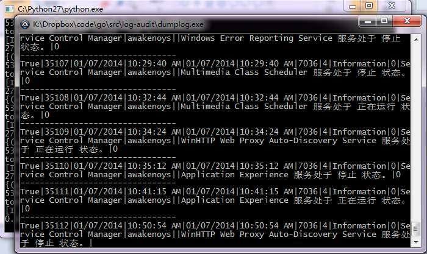
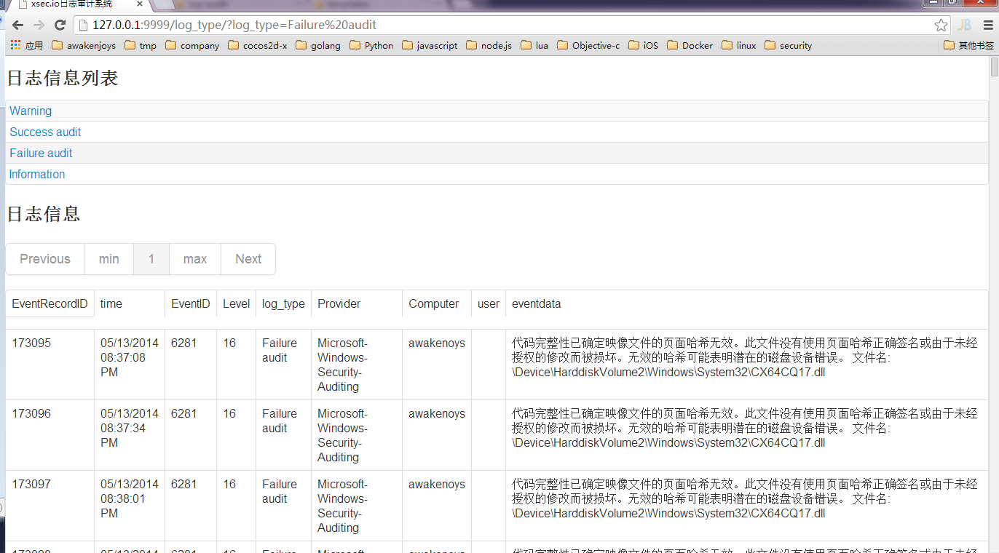

Windows event log audit system
==============

Windows事件日志审计系统，支持以WEB的方式审计日志

## Windows事件日志审计系统说明
Windows事件日志审计系统由2部分组成：

1. dumplog，导出windows的事件日志到sqlite3 数据库中，默认文件名为Eventlog.db
2. log_audit_web，查询日志的WEB

## 如何使用
### dumplog
dumplog由autoit3编写，需要编译为EXE（有时候编译出来的exe会被360误报为病毒），[autoit3下载地址](http://www.autoitscript.com/site/autoit/downloads/)

dumplog运行后会在当前目录下生成一个Eventlog.db文件，该文件为将windows日志将出的sqlite数据库文件



### log_audit_web

1. 安装python / tornado环境

log_audit_web由python / tornado编写，使用前需要安装python 2.7及tornado。
[tornado官网](http://www.tornadoweb.org/en/stable/)

2. 配置log_audit_web

```python
# -*- coding:utf8 -*-
from tornado.options import define, options

#服务器配置项
define("port", default=9999, help="run on the given port", type=int)
define("dbName", default="Eventlog.db", help="database name")
```

3. 运行log_audit_web
log_audit_web执行后，会在本地监听一个web端口，直接访问就可以查看日志了。
[demo](http://log_audit.xsec.io/)


## 计划：

1. 后端实现Windows日志集中管理系统（用golang重写）
1. dumplog可将日志发送到管理系统中
1. 支持完善的报表系统
1. 支持各种关键字查询

如有问题请联系：root@xsec.io


